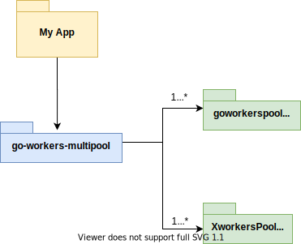

# go-workers-multipool
Manager for multiple(unlimited) pools of workers in Golang.

This is a wrapper to manage multiple pool of workers, currently of the kind:
https://github.com/enriquebris/goworkerpool

You can easily have many pools to execute different tasks and manage them separately.

## Current Features:
- Add multiple pools to be managed at the same time
- Define a function for the workers on a specific pool
- Start the workers on a pool
- Edit the amount of workers for a pool on the fly
- Kill multiple workers on a pool on the fly
- Add workers for a pool on the fly
- Pause all the workers for a pool
- Resume all the workers for a pool

### System Overview:



## Example Use Case:
### System to resize images

This system could use 2 different pools of workers, one to process low size images (< 5 MB), and a second pool to process 
the rest (> 5 MB). Since per the history, 70% of elements coming are bigger than 5 MB, and we want to do some extra work 
on them without affecting the conversion of the smaller ones, the pool for the bigger images could have more workers than 
the other. If at some point, we determine that we need only half of the current amount of workers converting big images, 
we can cut them in half on the fly without affecting anything else and without restarting the system.


### Quick Start: 

```go get github.com/ericbrisrubio/go-workers-multipool@v0.1-alpha.2```

#### Example code:

(Based on the previous use case about images conversion)

```go
package main

import (
	"fmt"
	"github.com/ericbrisrubio/go-workers-multipool/manager"
	"time"
)

func main() {

	poolsManager := manager.Manager{}

	// low-size pool definition
	poolsManager.AddPool("low-size", 3, 10, false)
	lowSizeFunc := func(data interface{}) bool{
		fmt.Printf("processed %s \n", data)
		return true
	}
	poolsManager.SetFunc("low-size", lowSizeFunc)
	poolsManager.StartPool("low-size")

	// big-size pool definition
	poolsManager.AddPool("big-size", 2, 10, false)
	bigSizeFunc := func(data interface{}) bool{
		fmt.Printf("processed %s \n", data)
		return true
	}
	poolsManager.SetFunc("big-size", bigSizeFunc)
	poolsManager.StartPool("big-size")

	//Start sending tasks to the low-size pool
	go func() {
		for {
			time.Sleep(time.Second*3)
			poolsManager.AddTaskToPool("low-size", "{image-path} for low size image")
		}
	}()

	//Start sending tasks to the big-size pool
	go func() {
		for {
			time.Sleep(time.Second*2)
			poolsManager.AddTaskToPool("big-size", "{image-path} for big-size image")
		}
	}()

	//Finish both pools processing after 10 seconds
	go func() {
		time.Sleep(time.Second*10)
		poolsManager.KillWorkersFromPool("low-size", 3)
		poolsManager.KillWorkersFromPool("big-size", 2)
	}()

	//Wait (blocks) until both pools has ended up processing the tasks
	poolsManager.WaitForAllPools()

}
```


### MIT License